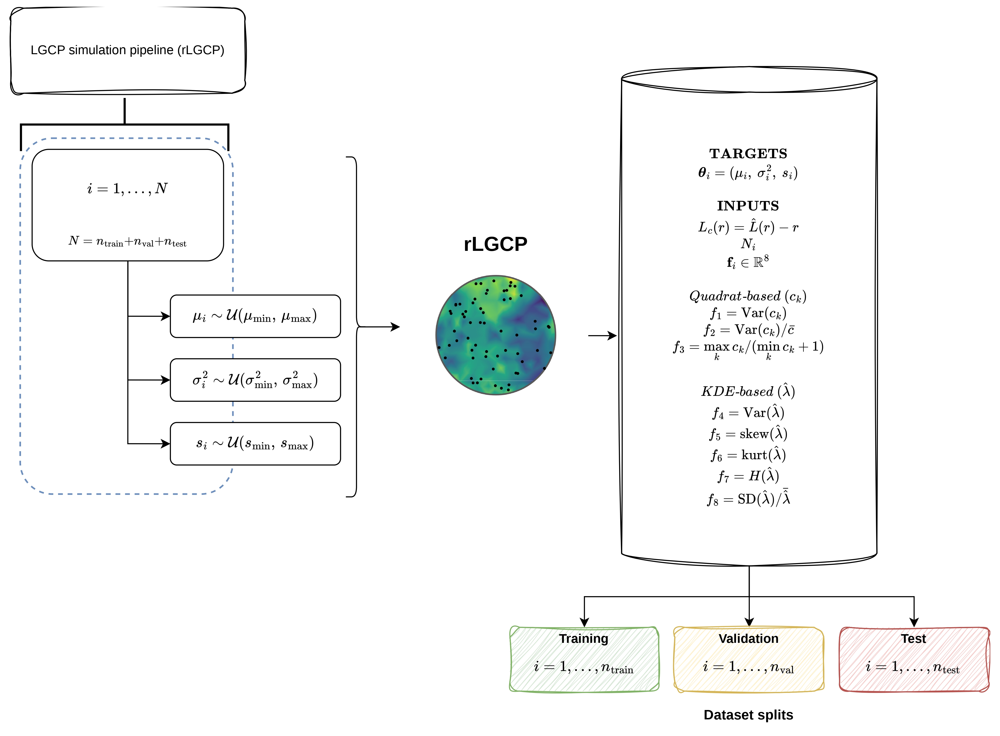
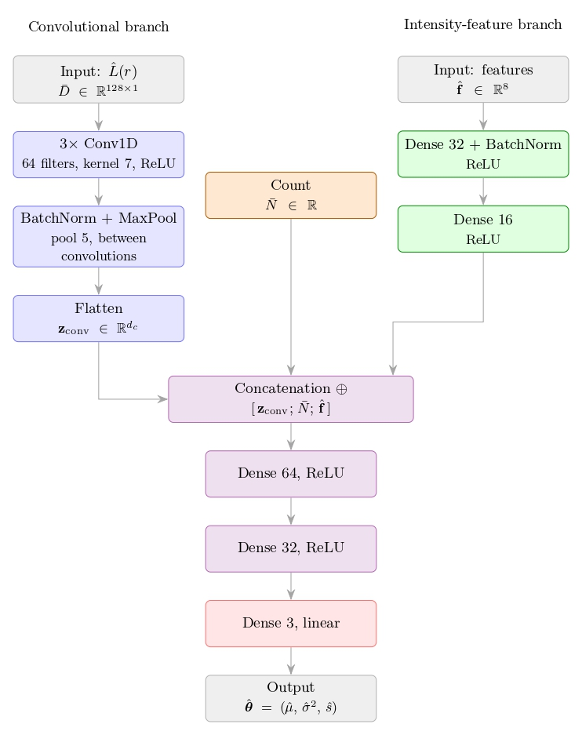

# LGCP Parameter Recovery via CNN with Intensity Features

## Abstract

The likelihood of a Log-Gaussian Cox Process (LGCP) has no closed form, as its evaluation requires marginalizing over a latent Gaussian field. Recent work replaces the likelihood with a convolutional neural network (CNN) trained on simulations, which predicts parameters from $\hat{L}(r)-r$ and point count $N$. Previously, this approach was tested only on square windows, and variance $\sigma^2$ and spatial range $s$ remain difficult to identify in practice.

This work augments the CNN with eight scalar descriptors of the smoothed intensity field: variance, index of dispersion, and range ratio computed on quadrat counts, together with variance, skewness, kurtosis, Shannon entropy, and coefficient of variation from kernel density estimation. The method is tested on a simulation study over Colombia's continental geometry and applied to the 2020 Colombian seismic catalogue. The descriptors raise $R^2$ for the spatial range $s$ from 0.57 to 0.83 (+46.1%) and for the variance $\sigma^2$ from 0.65 to 0.76 (+17.3%); for the mean $\mu$ a moderate improvement is also observed (0.81 to 0.88, +8.7%).

> **Status:** The associated manuscript has been submitted to the journal *Computers & Geosciences* for review.

---

## Methodology

For each simulated realisation, the LGCP parameters $(\mu, \sigma^2, s)$ are sampled, a point pattern $\mathbf{x}$ is generated with `rLGCP` (spatstat) on the continental window $W$ of Colombia using a Matérn covariance ($\nu=1$), the centred $L$ function $D(r)=\hat{L}(r)-r$ is estimated with border edge correction, and the eight intensity descriptors $\mathbf{f}=\Phi(\mathbf{x})\in\mathbb{R}^{8}$ are extracted from quadrat counts and a kernel density estimate. Each training example stores $\boldsymbol{\theta}=(\mu,\sigma^2,s)$ as the label and $(D(r),\,N,\,\mathbf{f})$ as the input.



## CNN Architecture

The $D(r)$ curve (128 values) is processed by a 1D-convolutional branch — three Conv1D layers (64 filters, kernel size 7) with batch normalization and max pooling — and flattened to $\mathbf{z}_{\mathrm{conv}}$. In parallel, the eight intensity descriptors pass through an auxiliary sub-network (Dense 32 → BatchNorm → Dense 16) producing $\mathbf{z}_{\mathrm{feat}}$. These are concatenated with the standardized point count $\tilde{N}$, fed through two dense layers (64, 32 units), and a linear output layer returns the three parameters $(\hat{\mu},\hat{\sigma}^2,\hat{s})$.



**Baseline CNN (M1)** — input $\hat{L}(r)-r$ + $N$ only (replication of Vihrs, 2022).
**Proposed CNN (M2)** — input $\hat{L}(r)-r$ + $N$ + the 8 intensity descriptors.

---

## Project Structure

```
.
├── scripts/
│   ├── simulations_rGLCP.R          # Generate LGCP simulations with feature extraction
│   └── CNN_train_and_predict.R      # Train CNN models and evaluate on real data
├── data/
│   ├── shapeZona_sp.rds             # Colombia boundary (window W)
│   └── sismos_sf_2020.rds           # 2020 Colombian seismic catalogue
├── Results_simulation/
│   ├── TRAIN/                       # Training data (simulated LGCP)
│   └── TEST/                        # Test data (simulated LGCP)
├── images/                          # Figures used in this README
└── README.md
```

## Features Extracted

### Quadrat-based (3 features)
- **quad_var**: Variance of counts in quadrats
- **quad_VMR**: Variance-to-Mean Ratio (Index of Dispersion)
- **quad_range_ratio**: Ratio of max/min quadrat counts

### Kernel Density (5 features)
- **kde_var**: Variance of smoothed intensity surface
- **kde_skew**: Skewness of density values
- **kde_kurt**: Excess kurtosis of density values
- **kde_entropy**: Normalized Shannon entropy of density
- **kde_cv**: Coefficient of variation of density

## Quick Start

### Requirements
- R ≥ 4.0
- Python 3.8+ (for TensorFlow/Keras integration)

### R Packages
```r
install.packages(c("spatstat", "tidyverse", "pbmcapply", "sf", "patchwork"))
# TensorFlow for R:
reticulate::install_python()
keras::install_keras()
```

### Step 1: Generate Training and Test Data
```r
source("scripts/simulations_rGLCP.R")
# Simulates LGCP realisations on the Colombia window and, for each one,
# computes D(r) = L(r) - r, the point count N, and the 8 intensity features.
# Saves .rds chunks with parameters + inputs in Results_simulation/TRAIN and /TEST.
```

### Step 2: Train CNN Models and Evaluate
```r
source("scripts/CNN_train_and_predict.R")
# Trains two models:
#   - M1: Baseline CNN  (L(r) + N)
#   - M2: CNN + 8 intensity features
# Evaluates on the held-out test set and applies the models to the
# 2020 seismic catalogue. Generates the metrics table and diagnostic plots.
```

## Results (Test Set)

Metrics are reported on the **standardized** parameter scale, so they are directly comparable across $\mu$, $\sigma^2$, and $s$.

| Parameter | Model | R² | RMSE | MAE |
|-----------|-------|------|-------|-------|
| μ  | Baseline      | 0.810 | 0.424 | 0.337 |
| μ  | CNN+Features  | **0.881** | 0.336 | 0.249 |
| σ² | Baseline      | 0.648 | 0.580 | 0.470 |
| σ² | CNN+Features  | **0.760** | 0.479 | 0.367 |
| s  | Baseline      | 0.566 | 0.665 | 0.527 |
| s  | CNN+Features  | **0.828** | 0.419 | 0.313 |

The intensity descriptors yield the largest gain on the spatial range $s$ (+46.1% in $R^2$), the hardest parameter to identify from second-order statistics alone.

### Application to the 2020 Colombian seismic catalogue ($N = 14{,}346$)

| Model | $\hat{\mu}$ | $\hat{\sigma}^2$ | $\hat{s}$ (m) |
|-------|------|------|------|
| CNN+Features | −21.64 | 6.09 | 72,346 |

## Output Files

After running the scripts, results are written to the figures directory:
- Predicted-vs-true scatter plots (baseline and proposed)
- Training/validation loss curves
- $R^2$ comparison by parameter
- $L(r)$ envelope and point-count validation under the fitted model

## License

[Specify your license, e.g., MIT, GPL-3.0]

## Contact

Jason Romero (jamromeror@udistrital.edu.co)
